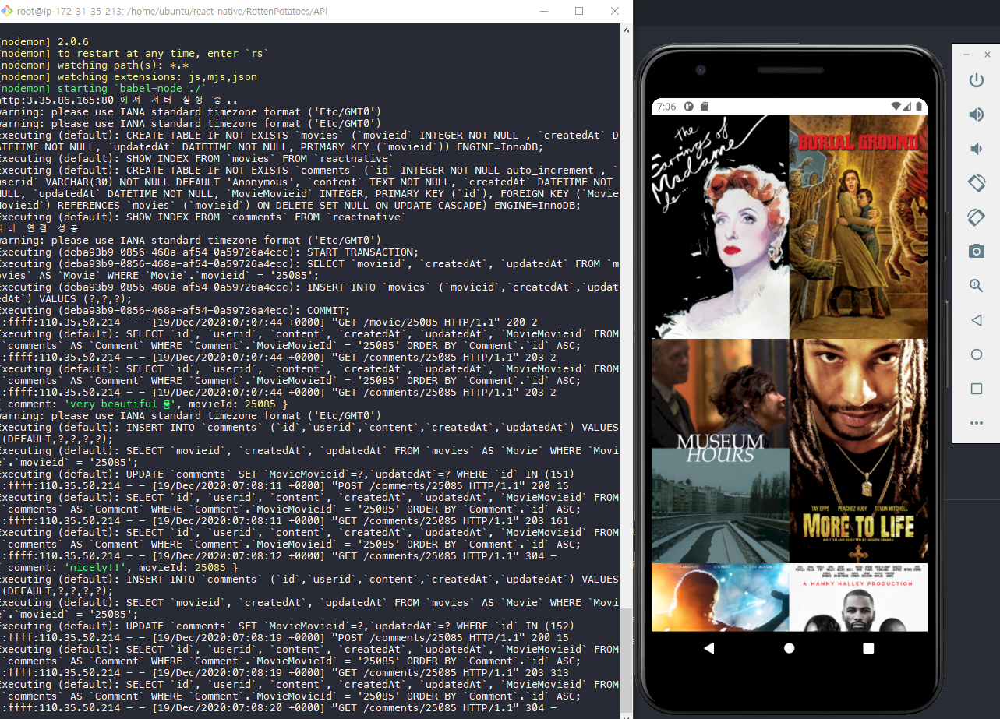
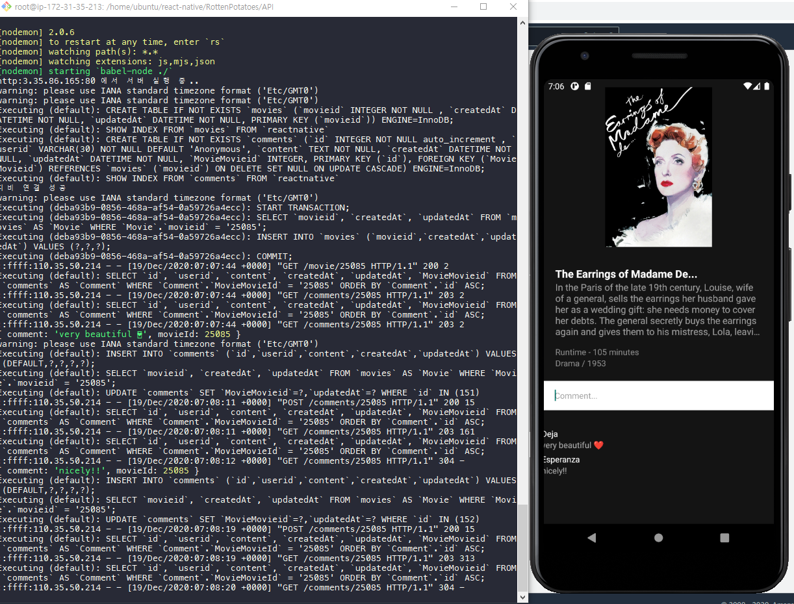

## React Native 영화 서비스 어플

# 스택
### 🐳 프런트엔드 🐋
* React Native.js
* Redux
* Redux Saga

### 🐠 백엔드 🐠
* Express.js

# 기능
* yts Movie api 를 이용한 영화 로딩
* 스크롤이 하단에 도착 시 15개 씩 비동기로딩 수행 ( redux saga )
* 영화 데이터 요청 시 서버에서 영화 id와 댓글정보를 매핑
* 댓글 요청, 작성 기능

### 😊 팀원 😊
* 정지용 ( wscrg ): Presentaitinoal Component 개발과 어플리케이션 Navigation Router 구현
* 최은기 ( galaxy4276 ): Redux 상태 관리와 API 요청. 그에 대응하는 백엔드 API 서버 로직 처리와 응답 구현, DB 서버와 AWS 배포환경을 구축

# 배포
* https://expo.io/accounts/galaxy4276/builds/8adbe341-83d8-48e0-b16a-2d515f7311f5
* AWS 서버가 비용문제로 중지 상태라, 댓글 기능이 정상작동하지않을 수 있습니다.

# 개발 화면

